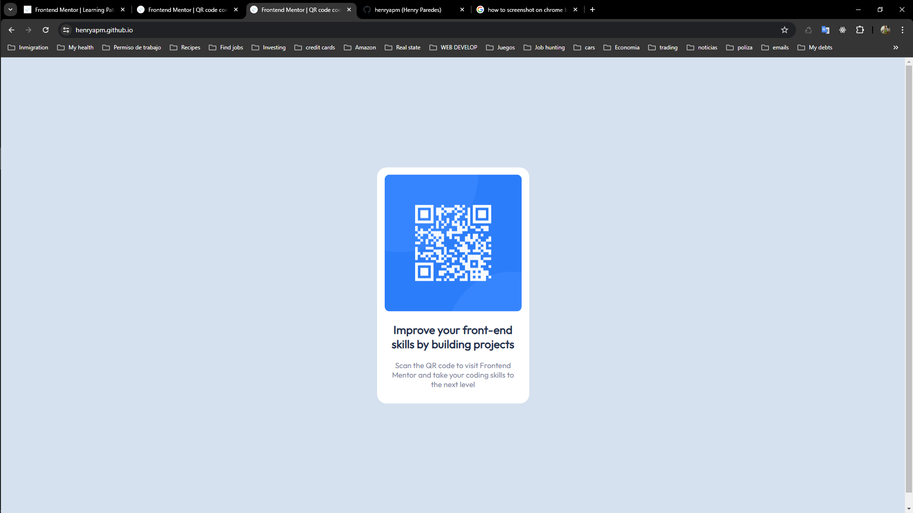

# Frontend Mentor - QR code component solution

This is a solution to the [QR code component challenge on Frontend Mentor](https://www.frontendmentor.io/challenges/qr-code-component-iux_sIO_H). Frontend Mentor challenges help you improve your coding skills by building realistic projects.

## Table of contents

- [Overview](#overview)
- [Screenshot](#screenshot)
- [Links](#links)
- [My process](#my-process)
- [Built with](#built-with)
- [What I learned](#what-i-learned)
- [Continued development](#continued-development)
- [Author](#author)

## Overview

This the first project I attempt to complete within frontendmentor.io and I gotta admit that it seemed easier at first than what it actually was. I came with challenges like I bet any of their other projects, in this case I put in practice HTML and CSS.

I'm excited to keep completing challenges and see where it takes me, after all I really love the feeling of completion and the result of my own efforts.

### Screenshot



### Links

- Temporary URL URL: [https://henryapm.github.io]

## My process

- I started by creating the HTML elemnts and giving them ids and classes to later use in the css.
- Adding the text that was supposed to be displayed along with the qr code image(since the component is static).
- Customize the css to make the component looks like the proposed solution to the challenge.
- Twike and compare to the desire solution till it looks very similar to it.

### Built with

- Semantic HTML5 markup
- CSS custom properties

### What I learned

I explored over the different ways to center elements and I decided to use just standard CSS, I could've used CSS grid or Flexbox but since this project was simple I decided to just use css with any of the advantages of the two mentioned previously
This is the css I used to center my component

```css
.center {
  position: absolute;
  top: 50%;
  left: 50%;
  transform: translate(-50%, -50%);
}
```

### Continued development

I'd like to keep a focus on developing my css and html knowledge, specially the use of semantic HTML, and Class naming convention.

## Author

- Website - [Henry Paredes](https://www.henryapm.github.io)
- Frontend Mentor - [@henryapm](https://www.frontendmentor.io/profile/henryapm)
